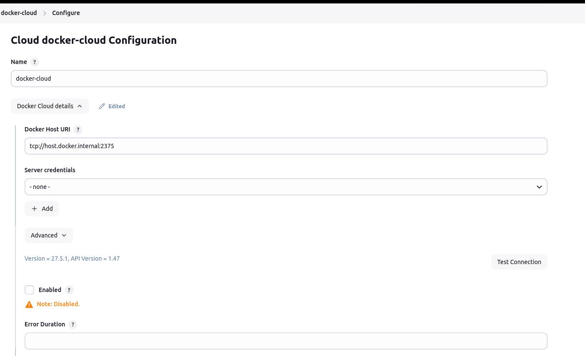
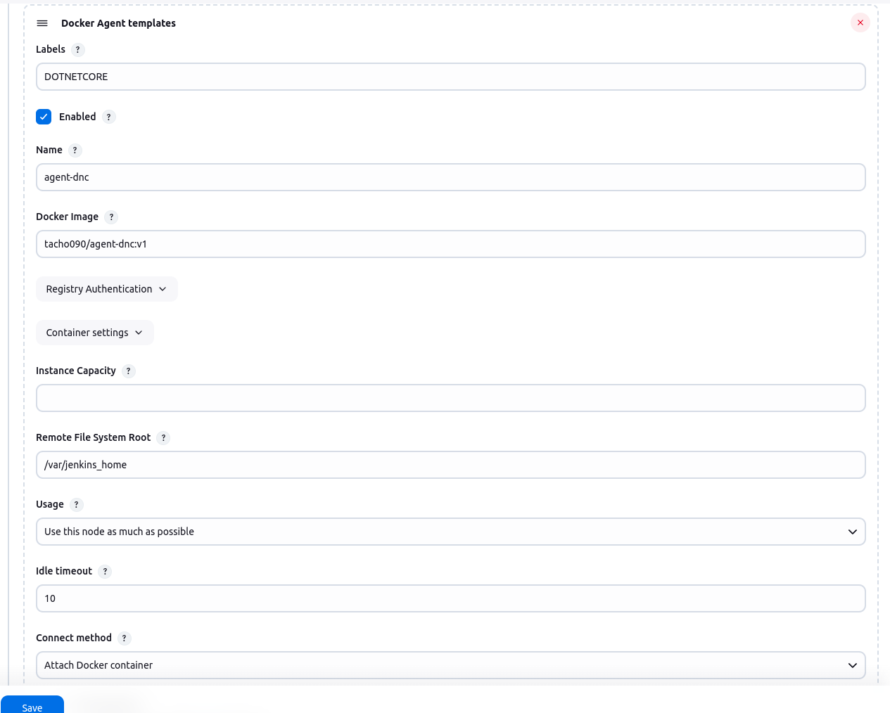

# jenkins_projects

### Quick start

1. Run `docker_build_jenkins.sh`


### How to Expose daemon on tcp://localhost:2375 without TLS

1. Override default configuration for docker daemon default port by opening this file:
```declarative
sudo vi /etc/systemd/system/docker.service.d/override.conf
```
2. Attach the following configuration to the file and save it:
```declarative
[Service]
ExecStart=
ExecStart=/usr/bin/dockerd -H unix:///var/run/docker.sock -H fd:// -H tcp://0.0.0.0:2375
```
3. Reload docker daemon and restart docker service
````shell
sudo systemctl daemon-reload
sudo systemctl restart docker.service
````
4. Update configuration in docker cloud configuration in Jenkins and test connection



### Configuration for DOTNETCORE labeled agent in Jenkins


